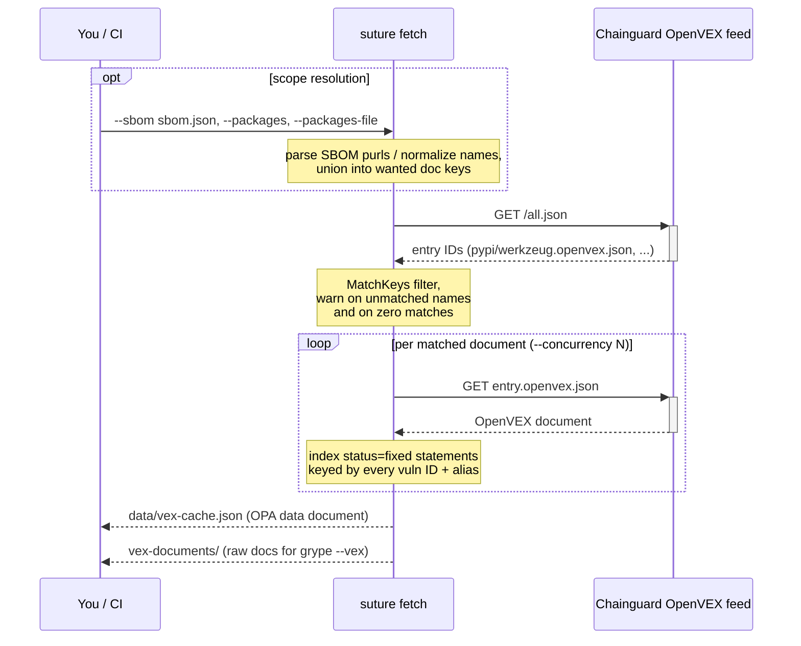
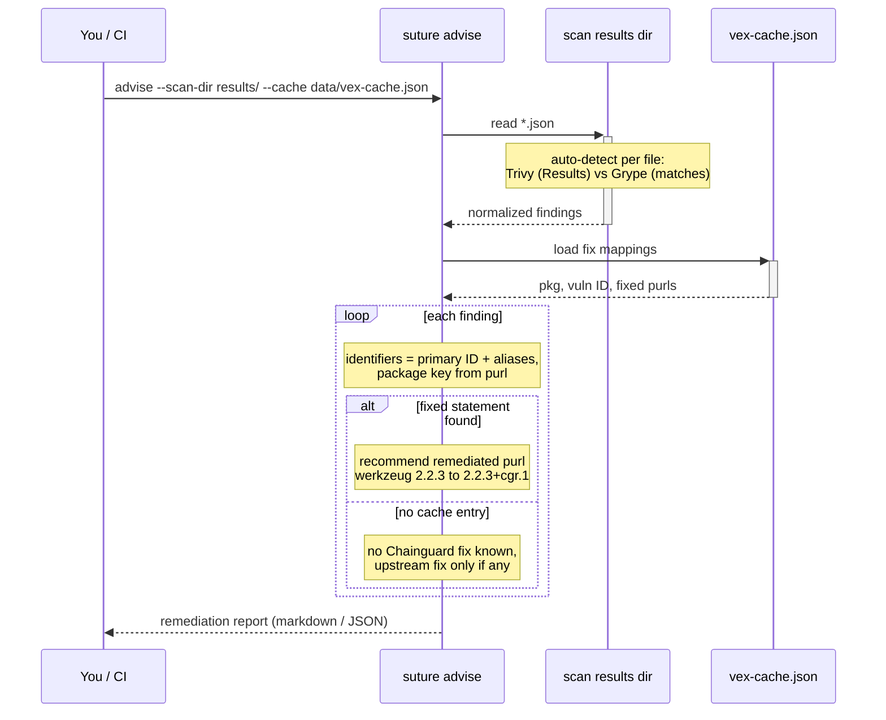

# suture

OpenVEX-aware remediation tooling for Chainguard Libraries. Cross-references
vulnerability scanner output against the Chainguard OpenVEX feed to find
**same-version backports** (`+cgr.N`), recommend a remediation path per
finding, and gate merges on unapplied fixes.

## Install

```sh
# Release binary
curl -sSfL https://github.com/mental-lab/suture/releases/latest/download/suture_$(uname -s | tr '[:upper:]' '[:lower:]')_$(uname -m | sed 's/x86_64/amd64/;s/aarch64/arm64/').tar.gz | tar xz suture
sudo install suture /usr/local/bin/

# Container (CI-friendly, runs on Wolfi-based Chainguard images)
docker run --rm -v "$PWD":/work -w /work ghcr.io/mental-lab/suture:latest --help

# From source
go install github.com/mental-lab/suture@latest
```

## Execution flow

### `fetch`



### `advise`



## Commands

### `fetch` — build the fix cache

```sh
suture fetch --out data/vex-cache.json
suture fetch --out data/vex-cache.json --write-docs vex-documents

# Scope the fetch to the packages you ship (flags compose as a union):
suture fetch --sbom sbom.json --write-docs vex-documents        # Syft/SPDX/CycloneDX
syft . -o syft-json | suture fetch --sbom -                     # or via stdin
suture fetch --packages werkzeug,flask                          # bare names, any ecosystem
suture fetch --packages pypi/werkzeug,npm/lodash                # eco/name pins one
suture fetch --packages-file requirements.txt                   # one per line; pins stripped
```

Fetches every per-package OpenVEX document and emits an OPA-consumable cache:

```json
{ "pkg:pypi/werkzeug": { "CVE-2023-25577": ["pkg:pypi/werkzeug@2.2.3%2Bcgr.1"] } }
```

Only `status: fixed` statements are indexed, keyed by **every** vulnerability
identifier (CVE, GHSA, …) so both Trivy- and Grype-reported IDs match.
`--write-docs` also materializes the raw documents for Grype's `--vex <dir>`
(VEX-aware scanning that suppresses fixed findings).

Without a scoping flag the whole feed is fetched. With one, only documents
for your packages are pulled; requested names that match nothing in the feed
are warned about, and a zero-match scope warns loudly since an empty cache
leaves the gate with nothing to enforce.

### `advise` — recommend a remediation path per finding

```sh
suture advise --scan-dir results/ --format markdown --out vex-report.md
suture advise --scan-dir results/ --assets security/asset-inventory.yaml --gate
```

Reads **Trivy and Grype** JSON (auto-detected per file — drop both scanners'
output in the same directory), looks each finding up in the feed, and decides:

- **backport** — Chainguard-built patched package exists (`status=fixed`); remediate
  without a breaking upstream upgrade
- **upgrade-or-replace** — no backport coverage; internet-facing Critical/High
- **exception-review** — no backport, lower risk context
- **none** — the backport is already applied (installed == fixed version)

`--gate` exits 1 when an internet-facing Critical/High finding has a Chainguard
fix available but not applied — the red→green flip when you adopt the backport.

### `policy export` — scaffold the Rego gate

```sh
suture policy export --dir policy/vex --asset-key my-service
```

Writes the default declarative gate (same logic as `advise --gate`, as Rego)
for evaluation with Conftest/OPA. Policy lives in your repo; the tool only
scaffolds it.

## CI usage (GitHub Actions)

```yaml
- name: Install suture
  run: |
    curl -sSfL https://github.com/mental-lab/suture/releases/latest/download/suture_linux_amd64.tar.gz \
      | tar xz suture
    sudo install suture /usr/local/bin/

- name: Build OpenVEX fix cache (scoped to the app's packages)
  run: suture fetch --sbom sbom.json --out data/vex-cache.json --write-docs vex-documents

- name: Remediation advisor
  run: suture advise --scan-dir results/ --assets security/asset-inventory.yaml --out vex-report.md

- name: Policy gate
  # --all-namespaces matters: conftest only evaluates the `main` package by
  # default and the exported policy is `package remediation` — without it
  # the gate silently passes.
  run: |
    yq -o=json '{"assets": .}' security/asset-inventory.yaml > assets.json
    jq '{vex_cache: .}' data/vex-cache.json > vex.json
    conftest test results/fs-scan.json \
      --policy policy/vex --all-namespaces \
      --data assets.json --data vex.json
```

## Supply chain

Every release ships with what you'd expect from a security tool:

- **Cosign keyless-signed** checksums (`checksums.txt.sig` / `.pem` per release)
- **SBOM** attached to every archive
- **Container images** built on `cgr.dev/chainguard/static` — multi-arch,
  minimal, zero-CVE base
